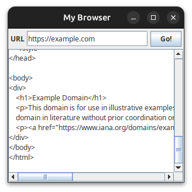

# xemantic-kotlin-swing-dsl

_Express your Swing code easily in Kotlin_

[](https://central.sonatype.com/namespace/com.xemantic.kotlin)
[](https://github.com/xemantic/xemantic-kotlin-swing-dsl/releases)
[](https://github.com/xemantic/xemantic-kotlin-swing-dsl/blob/main/LICENSE)

[](https://github.com/xemantic/xemantic-kotlin-swing-dsl/actions/workflows/build-main.yml)
[](https://github.com/xemantic/xemantic-kotlin-swing-dsl/actions/workflows/build-main.yml)
[](https://github.com/xemantic/xemantic-kotlin-swing-dsl/commits/main/)
[](https://github.com/xemantic/xemantic-kotlin-swing-dsl/commits/main/)

[](https://github.com/xemantic/xemantic-kotlin-swing-dsl/graphs/contributors)
[](https://github.com/xemantic/xemantic-kotlin-swing-dsl/commits/main/)
[]()
[](https://github.com/xemantic/xemantic-kotlin-swing-dsl/commit/39c1fa4c138d4c671868c973e2ad37b262ae03c2)
[](https://kotlinlang.org/docs/releases.html)
[](https://github.com/Kotlin/kotlinx.coroutines)

[](https://discord.gg/vQktqqN2Vn)
[](https://discord.gg/vQktqqN2Vn)
[](https://x.com/KazikPogoda)

## Why?

Kotlin provides incredible language sugar over pure Java. Using Kotlin for writing Swing UI already
makes the code more concise, but
**what if the Swing was written from scratch, to provide Kotlin-idiomatic way of doing things?**
This is the intent behind the `xemantic-kotlin-swing-dsl` library - to deliver a
[Domain Specific Language](https://en.wikipedia.org/wiki/Domain-specific_language)
for building Swing based UI and react to UI events by utilizing
[Kotlin coroutines](https://kotlinlang.org/docs/coroutines-overview.html). Historically I started this project when I needed to quickly assemble basic remote control
interfaces for my art robots, which are using software stack developed
in the [we-are-the-robots](https://github.com/xemantic/we-are-the-robots) project.

## Usage

Add to your `build.gradle.kts`:

```kotlin
dependencies {
  implementation("com.xemantic.kotlin:xemantic-kotlin-swing-dsl-core:1.2.14")
  runtimeOnly("org.jetbrains.kotlinx:kotlinx-coroutines-swing:1.8.1")
}
```

:warning: the `kotlinx-coroutines-swing` version should be aligned with the version of other coroutine
libraries used in your project. If unsure, find the latest version of the `kotlinx-coroutines` library.

## Example

Here is a simple internet browser. For the sake of example, instead of rendering
the full HTML, it will just download a content from provided URL address
and display it as a text.

```kotlin
import com.xemantic.kotlin.swing.*
import kotlinx.coroutines.*
import kotlinx.coroutines.flow.*
import java.awt.Dimension
import java.net.URI

fun main() = MainWindow("My Browser") { window ->
  window.preferredSize = Dimension(300, 300)

  val urlBox = TextField()
  val goButton = Button("Go!") { isEnabled = false }
  val contentBox = TextArea()

  urlBox.textChanges.listen { url ->
    goButton.isEnabled = url.isNotBlank()
  }

  merge(
    goButton.actionEvents,
    urlBox.actionEvents
  )
    .filter { goButton.isEnabled }
    .onEach { goButton.isEnabled = false }
    .map { urlBox.text }
    .flowOn(Dispatchers.Main)
    .map {
      try {
        URI(it).toURL().readText()
      } catch (e : Exception) {
        e.message
      }
    }
    .flowOn(Dispatchers.IO)
    .listen {
      contentBox.text = it
      goButton.isEnabled = true
    }

  BorderPanel {
    north {
      Border.empty(4) {
        BorderPanel {
          layout { gap = 4 }
          west { Label("URL") }
          center { urlBox }
          east { goButton }
        }
      }
    }
    center { ScrollPane { contentBox } }
  }
}
```

When run it will produce:



### Notable conventions

* No `J` prefix in UI component names (historically `J` was added to differentiate
  Swing components from AWT components and is mostly irrelevant for modern purposes).
* Main JFrame is created with the `MainWindow` builder, which also takes care of setting
  up the `SwingScope` holding a coroutine scope bound to Swing's event dispatcher thread.
* Instead of event listeners (callbacks), events are delivered through `Flow`s. The `listen()`
  function collects the flow in the newly launched coroutine, which is cancelled when the window
  is closed.
* Other coroutine dispatchers, like `IO`, can be used in the event processing pipeline
  by adding the `flowOn`. This makes the cumbersome `SwingWorker` obsolete.
* Each UI component can be immediately configured with direct access to its properties.
* Panels are specified with special builders, allowing intuitive development of the
  component tree.

### Key benefits

* compact UI code with minimal verbosity
* declarative instead of imperative UI building
* reactive event handling using `Flow`s, 

The code above is taken from the
[MyBrowserKotlin](demo/simple-kotlin-dsl/src/main/kotlin/MyBrowserKotlin.kt) demo.

### How would it look in pure Java Swing?

For the sake of comparison the
[MyBrowserJava](demo/simple-java/src/main/java/com/xemantic/kotlin/swing/demo/MyBrowserJava.java)
demo implements exactly the same "browser" in pure Java.

## Other examples

The [demo](demo) folder contains additional examples.

## Testing

This library is also supporting testing of presenters, if your code adheres to Model View Presenter
principles. You can check an example in the [mvp-presenter demo](demo/mvp-presenter) module.

Add this dependency to your `build.gradle.kts` for testing support:

```kotlin
dependencies {
  testImplementation("com.xemantic.kotlin:xemantic-kotlin-swing-dsl-test:1.2.14")
}
```
